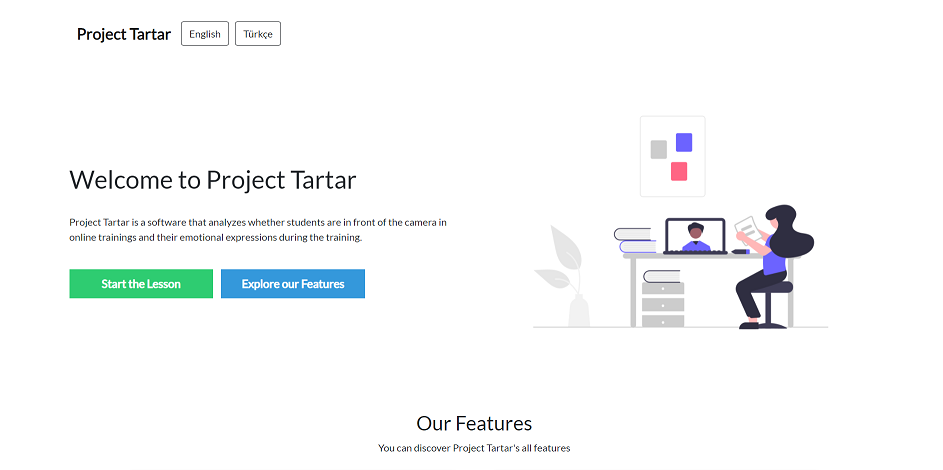
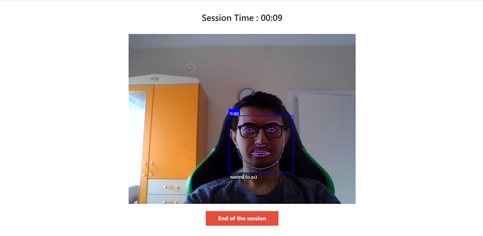
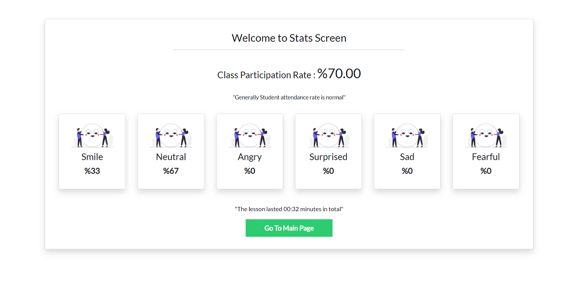

# Project Tartar ⭐️

> Akıllı online eğitim analiz aracı

Project tartar online eğitim sürecinde öğrencilerin derse katılım oranlarını ve ders boyunca gösterdikleri ruh hali ve duyguları yüz tanıma algoritmaları ile analiz etmeye çalışan bir yazılımdır. <br/>


## Kurulum Rehberi
Step-1 : Bu depoyu makinenize indirin.

```bash

git clone repo_address
```

Step-2 : İndirdiğiniz depo içerisinden project_folder/src/index.html dosyasını çalıştırın.

```bash

project_folder/src/index.html
```


## Nasıl Geliştirildi ?
Yüz tespiti ve duygu kontrolü aşamasında face_api.js kullanılmıştır. <br/>
Kamera başlatıldıktan sonra her 3 saniyede bir kontrol fonksiyonu tetiklenir. Böylelikle ekranda bir yüz tespiti yapılıp yapılmadığına bakılır. <br/>
Eğer yüz tespit edilirse yüzün o anki duygusu sisteme eklenir. <br/>
Dersi bitir butonuna tıklandığında sayfa içerisinde kameradan toplanan veri result ekranına aktarılır. Bu kısımda tüm istatistikler gösterilir.


## Örnek Resimler





## Geliştirici
Berke Kurnaz - [Github profile](https://github.com/berkekurnaz) - [Website](berkekurnaz.com)


## Katkı Sağlamak
Yapılan geliştirmeler için yeni bir pull request açıp gönderebilirsiniz. Sizden gelen katkılara Project Tartar her zaman açıktır.