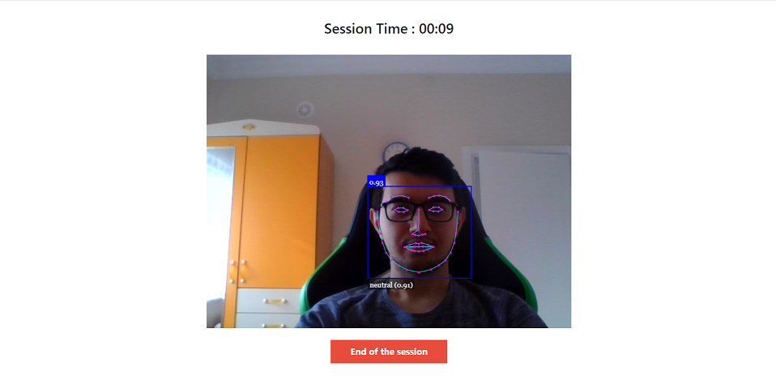
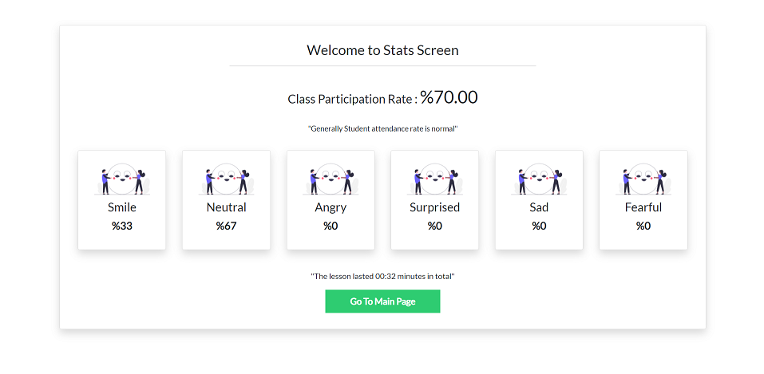

# Project Tartar ⭐️

> Smart online education analysis software

Project tartar is a software that analyzes student movements and emotions in online education. <br/>

With Project tartar, you can track the percentage of students attending the lesson, how long they follow the lesson in front of the camera during the lesson, and the emotions they show as a percentage throughout the lesson. <br/>


## Installation
Step-1 : Download this repository to your machine.

```bash

git clone repo_address
```

Step-2 : Open the project_folder/src/index.html file

```bash

project_folder/src/index.html
```


## How To Develop ?
I used face_api.js during the development phase of this project. In this way, I can easily make face tracking and emotional analysis. <br/>
Later, I checked if there was a face on the screen every 3 seconds on the class screen. If no face was detected countNoFace would increase by one. But if face detected countYesFace would increase by one. <br/>
In addition, we add to the memory what the participant's emotion is in case of face detection. <br/>
Clicking the end of the lesson button, we move all the data we have saved to the result screen. All statistics are shown here.


## Sample Images





## Developer
Berke Kurnaz - [Github profile](https://github.com/berkekurnaz) - [Website](berkekurnaz.com)


## Contributing
Pull requests are welcome. For major changes, please open an issue first to discuss what you would like to change.
Please make sure to update tests as appropriate.